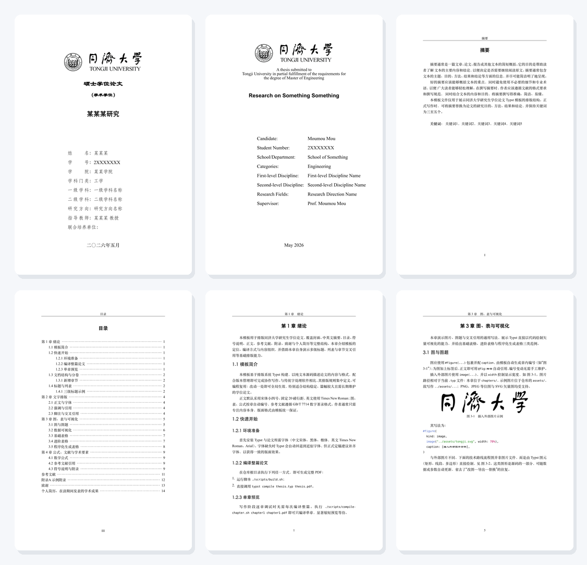
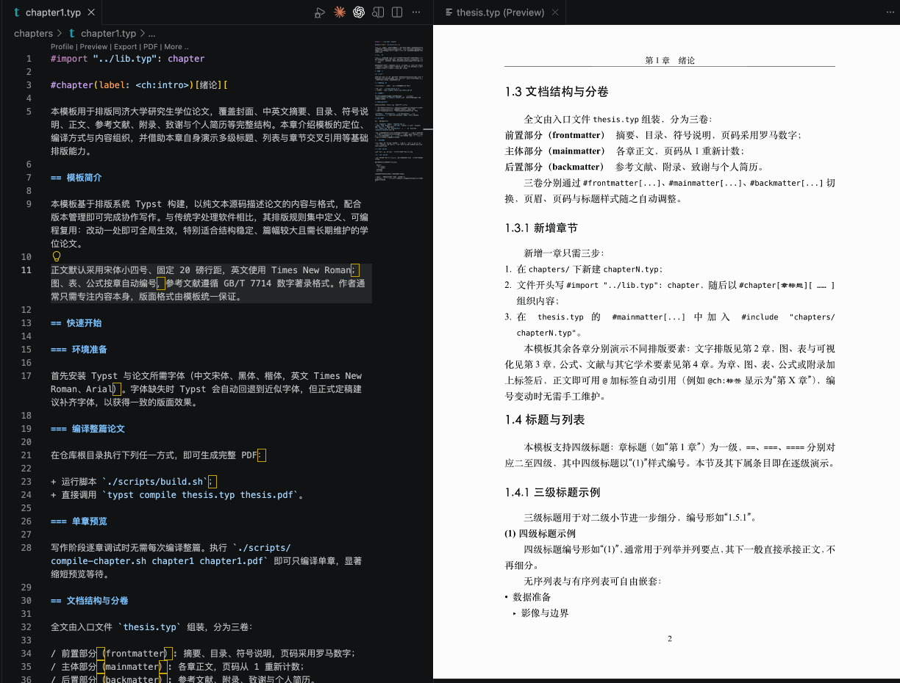

# tongji-thesis-typst

同济大学研究生学位论文 Typst 模板 | Tongji University Graduate Thesis Typst Template

基于 [Typst](https://typst.app) 的同济大学硕士学位论文 / 博士学位论文排版模板，支持中英双语排版、GB/T 7714 参考文献格式，以及章节独立预览。

## 预览



[查看完整 PDF 示例](assets/thesis-example.pdf)

### 协同编辑与实时预览



## 功能特性

- 中英文封面、书脊自动生成
- 中英文摘要页
- 自动生成目录
- GB/T 7714—2015/2025 数字编码制参考文献（默认 2025，可切换；中英文混排自动切换“等”/“et al.”）
- 图、表、公式按章节自动编号（基于 i-figured 包），正文 `@fig:` / `@tbl:` 引用自动显示为“图 2-1”“表 2-1”并使用正文同款字体字号
- 原创性声明与版权授权书
- 附录、致谢、简历与发表成果页
- 章节独立编译，快速预览

## 快速开始

### 环境要求

- [Typst](https://github.com/typst/typst) >= 0.12
- 中文字体：宋体（SimSun）、黑体（SimHei）、楷体（KaiTi）
- 标题编号：强制使用黑体栈（Source Han Sans / Noto Sans CJK / SimHei / Heiti），不使用 Arial 作为数字回退，并对连续数字编号做小幅字号与基线补偿以匹配中文标题字面高度
- 英文字体：Times New Roman、Arial

### 编译全文

```bash
typst compile thesis.typ thesis.pdf
```

或使用脚本：

```bash
./scripts/build.sh
```

### 单章预览

```bash
./scripts/compile-chapter.sh chapter1 chapter1.pdf
```

## 使用方法

### 1. 填写论文信息

编辑 [metadata.typ](metadata.typ)，填入论文标题、作者、导师、学院等元数据：

```typst
#let thesis-info = (
  degree: "硕士",
  degree_type: "学术学位",
  title: "某某某研究",
  author: "某某某",
  supervisor: "某某某 教授",
  school: "某某学院",
  date_zh: "二〇二六年五月",
  // ...
)
```

### 2. 撰写章节内容

在 `chapters/` 目录下创建各章节文件：

```typst
#import "../lib.typ": chapter

#chapter[第一章 标题]

这里是正文内容...
```

然后在 [thesis.typ](thesis.typ) 中引入：

```typst
#include "chapters/chapter1.typ"
#include "chapters/chapter2.typ"
```

### 3. 参考文献管理

将 BibTeX 条目写入 [references.bib](references.bib)，并标注语言。参考文献标题会保留 BibTeX 原文中的大小写，因此 `POI`、`LLM` 等缩略词无需额外加花括号保护：

```bibtex
@article{zhang2024,
  author = {张三 and 李四},
  language = {zh-CN},
  ...
}

@article{smith2024,
  author = {Smith, John and Doe, Jane},
  language = {en-US},
  ...
}
```

标准版本在 [metadata.typ](metadata.typ) 中统一配置：

```typst
#let bibliography-standard-version = "2025"
```

改为 `"2015"` 即可兼容旧稿。GB/T 7714—2025 于 2025-12-02 发布、2026-07-01 实施；
具体差异见 [GB/T 7714—2025 支持与迁移说明](docs/gb-t-7714-2025.md)。

使用 `language = {zh-CN}` 或 `language = {en-US}` 标记文献语言，以确保作者截断时正确显示"等"或"et al."。

网页/在线资源使用 `@online`，并填写 `url` 和 `urldate`。即使模板入口保持 `show-url: false` 以隐藏普通期刊论文的 URL，`@online` 条目仍会按 GB/T 7714 格式显示访问路径：

```bibtex
@online{ngcc_2024,
  author = {{国家地理信息公共服务平台}},
  title = {{2024版国家地理信息公共服务平台（天地图）正式发布}},
  date = {2024-04-26},
  url = {https://www.ngcc.cn/xwzx/ywcg/202404/t20240426_2410.html},
  urldate = {2026-05-27},
  language = {zh-CN},
}
```

在正文中引用：

```typst
如文献 @zhang2024 所述...
多位引用 @zhang2024 @smith2024 ...
```

## 项目结构

```
├── lib.typ                 # 公共 API — 所有模块导出入口
├── thesis.typ              # 全文编译入口
├── metadata.typ            # 论文元数据（标题、作者等）
├── references.bib          # 参考文献数据库
├── layouts/
│   ├── document.typ        # 文档模板（tongji-thesis 主函数）
│   ├── matter.typ          # 前言/正文/后记切换
│   └── declarations.typ    # 原创性声明与版权授权
├── pages/
│   ├── cover.typ           # 中英文封面与书脊
│   ├── abstract.typ        # 中英文摘要
│   ├── outline.typ         # 目录
│   ├── symbols.typ         # 符号表
│   └── backmatter.typ      # 参考文献、附录、致谢、简历
├── utils/
│   ├── typography.typ      # 字体栈、字号、基线节奏
│   ├── heading.typ         # 标题编号与格式
│   ├── text.typ            # 文本工具函数
│   ├── caption.typ         # 图表标题格式
│   └── metadata.typ        # 日期/学科格式工具
├── vendor/
│   └── gb7714-bilingual/   # GB/T 7714 双语参考文献引擎（改自 [pku-typst/gb7714-bilingual](https://github.com/pku-typst/gb7714-bilingual)）
├── chapters/               # 章节内容
├── appendices/             # 附录内容
├── preview/                # 单章预览示例
├── assets/                 # 校徽等图片资源
└── scripts/
    ├── build.sh            # 全文编译脚本
    └── compile-chapter.sh  # 单章编译脚本
```

## 排版规范

### 行距换算

Word 固定行距为基线到基线的目标距离。模板固定文字行框（`top-edge: 0.7em`, `bottom-edge: -0.3em`），使一行文字框高度等于一个字号。换算公式：

```
Typst leading = Word 行距 − 字号
```

| 场景 | Word 行距 | 字号 | Typst leading |
|------|-----------|------|---------------|
| 正文 | 20pt | 12pt | 8pt |
| 目录 | 18pt | 12pt | 6pt |

正文段落间 `spacing: 8pt` 仅用于保持跨段落基线在 20pt 节奏上，并非额外的段前/段后间距；正文相邻两行的字形视觉间隙约为 8pt。标题间距按学校 PDF 参考示例校准：正文章节页使用 `top-margin: 2.868cm` 与 `header-ascent: 0.338cm`，无标题续页的页眉横线到正文首行顶部约等于 8pt 字形视觉间隙；摘要、目录与后置页使用 `top-margin: 3.459cm` 与 `header-ascent: 0.929cm`，英文摘要因字体指标使用 `top-margin: 3.385cm` 与 `header-ascent: 0.855cm`。页眉横线正下方若直接出现一级或二级标题，标题文字上边缘到页眉横线保持 24pt 段前距离；章节首页在章标题前补入 16.3pt，页首二级标题在标题块内补入 16.2pt。页眉文字到横线使用实测视觉间距；章标题视觉段后约 14pt；一级标题（如 `1.1`）视觉段后约 20.3pt，以匹配参考 PDF 中页眉、页眉横线、章标题、一级标题和正文首行的实测位置。页码高度也按参考 PDF 校准：正文/后置页使用 `footer-descent: 0.63cm`，摘要和目录等前置页使用 `footer-descent: 0.69cm`。摘要页标题到正文、目录标题到首条目录项、参考文献/致谢/个人简历标题到正文首行均按参考 PDF bounding box 校准；目录条目行距实测对齐 18pt。

### 参考文献引擎

使用项目内置的 `vendor/gb7714-bilingual` 引擎渲染参考文献，每个入口文件需调用：

```typst
#import "vendor/gb7714-bilingual/lib.typ": init-gb7714
#import "metadata.typ": bibliography-standard-version

#show: init-gb7714.with(
  read("references.bib"),
  style: "numeric",
  version: bibliography-standard-version,
  show-url: false,
  show-doi: false,
)
```

内置引擎会用原始 BibTeX 字段覆盖 `citegeist` 对 `title`、`booktitle`、`journal` 等展示字段的大小写正规化，避免中文题名中的 `POI` 等缩略词被渲染为 `poi` 或 `Poi`。网页/在线资源的 URL 是 GB/T 7714 必备访问路径，`@online` 条目会显示 URL；普通文献仍受 `show-url: false` 控制。电子版图书、期刊、报告等应显式填写 `medium = {OL}`。

### 附录用法

附录应使用模板提供的 `#appendix` 入口，而不是手写一级标题：

```typst
#appendix(label: <app:example>)[补充实验结果][
  ...
]
```

- 传入的标题应为**裸标题**，不要手写 `附录A` / `附录B`
- 模板会自动在正文标题、页眉、目录和 `@app:...` 引用中补齐 `附录A`、`附录B` 等前缀
- `label` 可选；若需要交叉引用，推荐使用 `app:` 前缀，如 `@app:example`

## License

本项目仅供学习交流使用。同济大学学位论文格式版权归同济大学所有。

## 致谢

参考文献引擎基于 [pku-typst/gb7714-bilingual](https://github.com/pku-typst/gb7714-bilingual) 改造，感谢原作者的贡献。
